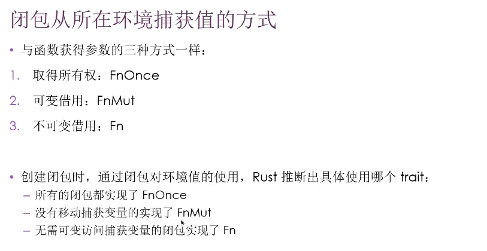

# 总结

- 闭包：可以捕获其所在环境的匿名函数
    - 匿名函数
    - 保存为变量、作为参数
    - 可在一个地方创建闭包，在另一个上下文中调用闭包来完成运算
    - 可从其定义的作用域捕获值

- 闭包的类型推断
    - 闭包并不需要标注参数和返回值的类型
    - 在狭小的上下文中使用，编译器可以推断出来
    - 可以手动添加类型
        - ```rust let expensive_closure = |name: String| -> u32 { } ```
    - 闭包的定义最终只会为参数和返回值推断出唯一具体的类型

    - 函数和闭包的定义对比
    ```rust
        fn  add_one_v1   (x: u32) -> u32 { x + 1 }
        let add_one_v2 = |x: u32| -> u32 { x + 1 };
        let add_one_v3 = |x|             { x + 1 };
        let add_one_v4 = |x|               x + 1 ;
    ```

    - 闭包捕获变量的方式（函数不能捕获变量）：
        - 
        - 在参数列表前使用 move 关键字，可以强制闭包取得它所使用的环境值的所有权
            - 当将闭包传递给新线程以移动数据使其归新线程所有时，此技术最有用

- 使用泛型参数和 Fn trait 来存储闭包
    - 解决闭包重复计算的问题
    - 创建一个 struct 持有闭包及调用结果
        - 只会在需要结果时才执行该闭包
        - 可缓存结果
        - 模式叫做 记忆化，或延迟计算
    - 如何让 struct持有闭包
        - struct 的定义需要知道所有字段的类型，需要指明闭包的类型
        - 每个闭包实例都有自己的唯一的匿名类型
        - 使用泛型和 trait bound 来存储闭包
        - 所有闭包都至少实现以下 trait 之一：
            - Fn
            - FnMut
            - FnOnce
        - FnOnce 消费从周围作用域捕获的变量，闭包周围的作用域被称为其 环境，environment。为了消费捕获到的变量，闭包必须获取其所有权并在定义闭包时将其移动进闭包。其名称的 Once 部分代表了闭包不能多次获取相同变量的所有权的事实，所以它只能被调用一次。
        - FnMut 获取可变的借用值所以可以改变其环境
        - Fn 从其环境获取不可变的借用值
    - [闭包：可以捕获环境的匿名函数](https://github.com/endruz/kulolo/blob/main/%E7%BC%96%E7%A8%8B%E8%AF%AD%E8%A8%80/Rust/1-Rust%E7%A8%8B%E5%BA%8F%E8%AE%BE%E8%AE%A1%E8%AF%AD%E8%A8%80/13.Rust%20%E4%B8%AD%E7%9A%84%E5%87%BD%E6%95%B0%E5%BC%8F%E8%AF%AD%E8%A8%80%E5%8A%9F%E8%83%BD%EF%BC%9A%E8%BF%AD%E4%BB%A3%E5%99%A8%E4%B8%8E%E9%97%AD%E5%8C%85/13.1-%E9%97%AD%E5%8C%85%EF%BC%9A%E5%8F%AF%E4%BB%A5%E6%8D%95%E8%8E%B7%E7%8E%AF%E5%A2%83%E7%9A%84%E5%8C%BF%E5%90%8D%E5%87%BD%E6%95%B0.md#%E9%87%8D%E6%9E%84%E4%BD%BF%E7%94%A8%E9%97%AD%E5%8C%85%E5%82%A8%E5%AD%98%E4%BB%A3%E7%A0%81)

# 迭代器
- 负责：
    - 遍历每个项
    - 确定遍历何时结束
    - 懒惰的：除非调用消费迭代器的方法，否则迭代器本身没有任何效果

- iterator trait 和 next 方法
    - 所有的迭代器都实现了 iterator trait
    - 定义于标准库中
    ```Rust  
        pub trait Iterator {
            type: Item,
            fn next(&mut self) -> Option<Self::Item>;
        }
    ```
    - type Item 和 Self::Item 该 trait 关联的类型

    - iter 方法：在不可变引用上创建迭代器
    - into_iter: 创建的迭代器会获得所有权
    - iter_mut： 迭代可变的引用

    - 消耗型适配器：调用 next 的方法，因为会把迭代器消耗尽
        - 比如 sum 方法
    - 迭代器适配器：把迭代器转换成不同种类的迭代器，通过链式调用多个迭代器适配器来执行复杂的操作
        - 比如 map 方法
            - 接受一个闭包，闭包作用于每个元素
            - 产生一个新的迭代器


    - 迭代器的 filter 方法获取一个使用迭代器的每一个项并返回布尔值的闭包。如果闭包返回 true，其值将会包含在 filter 提供的新迭代器中。如果闭包返回 false，其值不会包含在结果迭代器中

    -[使用迭代器处理元素序列](https://github.com/endruz/kulolo/blob/main/%E7%BC%96%E7%A8%8B%E8%AF%AD%E8%A8%80/Rust/1-Rust%E7%A8%8B%E5%BA%8F%E8%AE%BE%E8%AE%A1%E8%AF%AD%E8%A8%80/13.Rust%20%E4%B8%AD%E7%9A%84%E5%87%BD%E6%95%B0%E5%BC%8F%E8%AF%AD%E8%A8%80%E5%8A%9F%E8%83%BD%EF%BC%9A%E8%BF%AD%E4%BB%A3%E5%99%A8%E4%B8%8E%E9%97%AD%E5%8C%85/13.2-%E4%BD%BF%E7%94%A8%E8%BF%AD%E4%BB%A3%E5%99%A8%E5%A4%84%E7%90%86%E5%85%83%E7%B4%A0%E5%BA%8F%E5%88%97.md)